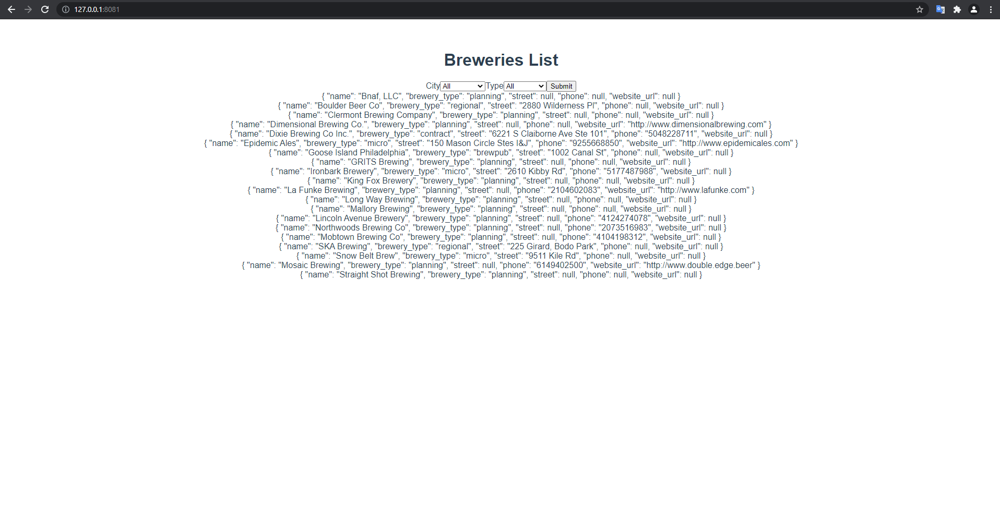

# Foxconn iAI Frontend Engineer Interview

## Project setup
```
yarn install
```
or
```
npm install
```

### Compiles and hot-reloads for development
```
yarn serve
```
or
```
npm run serve
```

## Challenge 
This challenge is designed to test a candidats ability to fetch data from an external API and render specific properties on the browser as well as screen for basic JS, HTML, and CSS fluency. 

**Coding time: 1h**

In order to complete this challenge, the candidate should be familiart Vue 3 Composition api(ref, watch, props, single file components), HTML, CSS, and JS.

Googling is allowed!

### Overview
Use the following [api](https://www.openbrewerydb.org/documentation/01-listbreweries) to build a dropdown filter that filters the breweries in Milwaukee by brewery type. 

<b>Each Brewery should show</b>
- name
- brewery_type
- street
- phone
- website_url (if available)



To parse the phone number use [this](https://stackoverflow.com/questions/8358084/regular-expression-to-reformat-a-us-phone-number-in-javascript) stackoverflow solution.


